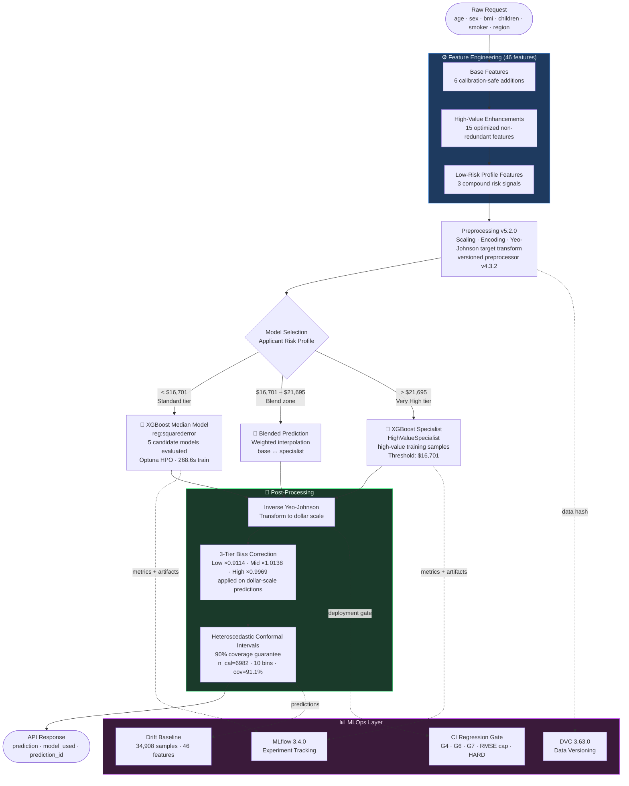

<div align="center">

# 🏥 Insurance Premium Prediction System

### A production-grade ML pipeline with hybrid routing, conformal prediction guarantees, and full MLOps instrumentation

[](https://github.com/PRANAVGAWALE-DS/Actuarial-Pricing-Engine/actions/workflows/ci.yml) [](https://github.com/PRANAVGAWALE-DS/Actuarial-Pricing-Engine/actions/workflows/cd.yml) [](https://www.python.org/downloads/) [](https://xgboost.readthedocs.io) [](https://fastapi.tiangolo.com) [](https://mlflow.org) [](https://dvc.org) [](htmlcov/) [](https://github.com/astral-sh/ruff) [](pyproject.toml)

<br/>

**R² = 0.9006 &nbsp;|&nbsp; RMSE = \$3,812 &nbsp;|&nbsp; MAE = \$2,549 &nbsp;|&nbsp; 90% Conformal Coverage Guaranteed**

<br/>

> *Most insurance pricing models treat every applicant the same. This one doesn't.*  
> *High-value claims (\$16,701+) are routed to a dedicated specialist model with a blended transition zone — because the tails of a distribution deserve their own model.*

</div>

---

## Table of Contents

- [The Problem & Why It's Hard](#the-problem--why-its-hard)
- [Architecture Overview](#architecture-overview)
- [Key Technical Features](#key-technical-features)
- [Dataset](#dataset)
- [Model Performance](#model-performance)
- [Project Structure](#project-structure)
- [Quickstart](#quickstart)
- [API Reference](#api-reference)
- [Experiment Tracking](#experiment-tracking)
- [CI/CD Pipeline](#cicd-pipeline)
- [Development Guide](#development-guide)
- [Notebooks & Reports](#notebooks--reports)
- [Known Limitations](#known-limitations)
- [Roadmap](#roadmap)


---

## 🎯 The Problem & Why It's Hard

Insurance premium prediction is deceptively simple on the surface — a regression problem with a handful of features. But a production-grade pricing engine must solve several compounding challenges simultaneously:

**The Distribution Problem.** Medical costs are right-skewed and heavy-tailed. A single high-cost claimant can be 30× the average. A standard regression model trained on squared error will systematically underfit the tail precisely where pricing accuracy matters most financially.

**The Uncertainty Problem.** Quoting a single number is commercially irresponsible. Regulators and actuaries want calibrated confidence intervals — not arbitrary ±20% bands, but *statistically guaranteed* coverage at a stated level.

**The Bias Problem.** Yeo-Johnson transformation of the target introduces inverse-transform bias at inference time. Three-tier multiplicative bias correction (segmented at the $9,257 and $14,276 quantiles) is applied post-prediction to recenter the distribution.

**The Segment Problem.** A single global model achieves R²=0.90 overall, but produces negative R² on narrow charge bands (Low–High+) due to the bimodal distribution of insurance charges. The solution: a dedicated `HighValueSpecialist` XGBoost model with a smooth blend zone, activated automatically at inference above `$16,701`.

This system solves all four.

---

## 🏗️ Architecture Overview



---

## ✨ Key Technical Features

### 🎯 Two-Model Hybrid Architecture
The system deploys two XGBoost models with automatic routing. The base model (`xgboost_median`, `reg:squarederror`) handles the full distribution. For predictions above `$16,701`, a `HighValueSpecialist` model trained exclusively on high-value samples takes over — with a smooth linear blend zone between `$16,701` and `$21,695` preventing sharp discontinuities at the routing boundary.

### 📐 Conformal Prediction Intervals
Prediction intervals are not heuristic bands — they carry a **distribution-free coverage guarantee** via split-conformal inference. Calibrated on 6,982 held-out validation predictions using a **heteroscedastic (10-bin) conformal** method, the system achieves **91.1% empirical coverage** on the test set (target: 90%), with per-segment reporting:

| Segment | Coverage | Avg Width |
|---------|----------|-----------|
| Low charges | 86.0% | $6,305 |
| Mid charges | 92.7% | $12,115 |
| High charges | 94.6% | $32,907 |
| **Overall** | **91.1%** | **$17,058** |

> Note: Heteroscedastic conformal inference is fully implemented (10 bins, winsorized at 99th percentile). Per-bin coverage is derived from stored training artifacts at calibration time, giving segment-adaptive widths rather than a single global quantile.

### 🔬 Yeo-Johnson Target Transformation
Raw insurance charges are right-skewed. A Yeo-Johnson transform is applied to the target before training, with a versioned preprocessor artifact (`preprocessor_v5.2.0.joblib`, v4.3.2). Inverse-transform at inference is handled by `FeatureEngineer.inverse_transform_target()`, with a 3-tier multiplicative bias correction (`var_low=-0.185589`, `var_high=-0.006120`) to remove systematic underprediction introduced by Jensen's inequality.

### 🧪 Post-Hoc Calibration with Holdout Validation
A linear calibrator (slope=0.9818, intercept=0.2311) is fit on a 60% calibration split and evaluated on a 40% holdout. Deployment is conditional: calibration is only applied if holdout RMSE improves >1% AND R² does not regress AND MAE does not worsen >2%. In the current run, the uncalibrated model was retained (calibrated MAE worsened 2.38%).

### ⚗️ Optuna HPO with MLflow Integration
Hyperparameter optimisation runs via Optuna with full MLflow tracking. Each trial logs `optuna_trial_value`, `hpo_best_value`, `cv_mean`, `cv_std`, `pinball_gap_pct`, `training_time_s`, and GPU peak memory. The `xgboost_median` model achieved a train/val gap of +4.2% — classified as **Minimal Overfitting**.

### 🔍 SHAP Explainability & Feature Importance
SHAP analysis is run on the best model post-training, generating force plots, summary plots, and worst-prediction explanations saved to `reports/shap/`. Feature importance below is derived from XGBoost's tree-based `feature_importances_` attribute (gain-based split weighting), which is the fast global ranking used for diagnostics. SHAP values for local per-prediction explanations are computed separately in `04_explainability.ipynb`.

Top features by tree importance:

| Rank | Feature | Tree Importance |
|------|---------|----------------|
| 1 | `smoker` | 0.3762 |
| 2 | `smoker_children` | 0.2788 |
| 3 | `smoker_bmi_squared` | 0.1520 |
| 4 | `age_cost_floor` | 0.0464 |
| 5 | `age_group_senior` | 0.0345 |

The top two features are both smoker-interaction terms (`smoker` raw flag and `smoker_children`), contributing over 65% of total split gain — confirming smoking status is the dominant pricing signal. `smoker_bmi_squared` captures the compounding effect of obesity for smokers.

### 🔒 Pre-load SHA-256 Checksum Verification
Model artifacts are SHA-256 verified **before** `joblib.load()` is called — not after. This ordering is security-critical: deserialisation happens during `joblib.load()`, so loading an unverified file creates an RCE window. Checksums are generated post-training with `scripts/generate_checksums.py` and stored alongside each artifact as `<model_stem>_checksum.txt`. At startup, `api/main.py` calls `_verify_model_checksums()` which:

- **Match** → logs ✅ INFO, continues normally
- **Checksum file absent** → logs ⚠️ WARNING, continues (backward-compatible with pre-checksum artifacts)
- **Mismatch** → raises `RuntimeError`, aborts startup

### 🔒 CI Model Regression Gate
Every training run must pass a programmatic gate (`scripts/ci_model_gate.py`) before the Docker image is built. The gate trains a minimal XGBoost pipeline on sample data and evaluates 6 checks, with thresholds sourced directly from `configs/config.yaml`:

| Gate | Check | Threshold |
|------|-------|-----------|
| `G6_r2_above_minimum` | Test R² | ≥ 0.70 (proxy for production cost-weighted R² ≥ 0.75) |
| `G7_overpricing_rate` | Overpriced (>10% above actual) | ≤ 62% |
| `G4_train_val_gap` | (val_rmse − train_rmse) / train_rmse | ≤ 15% |
| `RMSE_cap` | Test RMSE on sample data | ≤ $7,000 |
| `HARD_no_nan_predictions` | Any NaN in output | Must be False |
| `HARD_no_negative_predictions` | Any negative premium | Must be False |

Results are saved to `reports/ci_gate_results.json` and uploaded as a CI artifact. Any gate failure exits with code 1, blocking the CD pipeline.

---

## 📂 Dataset

| Property | Detail |
|----------|--------|
| **Source** | [UCI Medical Cost Personal Datasets](https://www.kaggle.com/datasets/mirichoi0218/insurance) (`data/raw/insurance.csv`) |
| **Total samples** | 51,337 |
| **Raw features** | 6 — `age`, `sex`, `bmi`, `children`, `smoker`, `region` |
| **Engineered features** | 46 (after pipeline: interaction terms, risk scores, BMI–age combos) |
| **Target** | Annual insurance charges (USD) |
| **Target range** | \$1,121.87 – \$63,770.43 (right-skewed; Yeo-Johnson applied) |
| **Train / Val / Test split** | 34,908 / 8,728 / 7,701 — stratified with 7 cost-aware bins (P99 tail-protected) |
| **High-value fraction** | ≈25% (>$16,688) consistently across all three splits |
| **Drift baseline** | 34,908 samples · 46 features (`models/drift_baseline.json`) |

---

## 📊 Model Performance

### Benchmark — 5 Models Evaluated

| Model | Val RMSE | Val R² | Train/Val Gap | Overfitting | Train Time | GPU Accel. |
|-------|----------|--------|---------------|-------------|------------|------------|
| **xgboost_median** ⭐ | $3,896 | 0.8963 | +4.2% | Minimal | 268.6s | ✔ |
| lightgbm | $3,964 | 0.8926 | pinball +3.0% | Quantile gap | 654.1s | ✔ |
| random_forest | $3,971 | 0.8922 | +5.5% | Minimal | 742.1s | — |
| xgboost | $4,006 | 0.8904 | pinball +1.2% | Quantile gap | 1047.3s | ✔ |
| linear_regression | $4,157 | 0.8819 | +1.8% | Minimal | 27.1s | — |

> ⭐ `xgboost_median` selected as deployment artifact — best Val RMSE at a fraction of the `xgboost` training time (268.6s vs 1047.3s), with `reg:squarederror` chosen over quantile objectives for the median model role.

### Final Test Performance (`xgboost_median` · n=7,701)

| Metric | ML Only | Hybrid |
|--------|---------|--------|
| **RMSE** | **$3,935.61** | **$3,934.34** |
| **MAE** | — | — |
| **R²** | **0.9006** (train) | — |
| **MAPE** | 25.41% | 26.37% |
| **MALE** | 0.267 | 0.270 |
| **SMAPE** | 25.99% | 26.37% |
| Conformal Coverage (90% target) | 91.1% ✅ | 90.7% ✅ |
| Avg CI Width (90%) | $17,058 | $11,680 |
| Within ±5% | 16.30% | — |
| Within ±10% | 29.97% | — |
| Within ±20% | 52.93% | — |
| Overpricing Rate | 45.8% (≤62% ✅) | — |
| Cost-Weighted R² | 0.8788 (≥0.75 ✅) | — |

### Business KPIs (Hybrid vs ML · 7,701 policies)

| KPI | ML Only | Hybrid | Delta |
|-----|---------|--------|-------|
| **Net Profit** | $4,738,837 | $5,048,233 | **+$309,396 (+6.5%)** |
| Profit per Policy | $615 | $656 | +$41 |
| Underpricing Rate | 53.2% | 51.3% | ✅ −1.9pp |
| Churn Rate | 3.94% | 4.67% | ⚠️ +0.73pp |
| Tail Risk Mitigation | — | $17,420 saved | ✅ |
| Deployment Confidence | — | **80% (4/5 wins)** | HIGH |

> Metric wins: ✅ Profit ✅ BizScore ✅ TailRisk ✅ UnderpriceRisk ❌ Churn — **Recommendation: DEPLOY HYBRID**

### Per-Segment Breakdown (Base Model · n=7,701)

| Segment | N | R² | RMSE | Overpricing |
|---------|---|----|----|------------|
| Low | 2,072 | −0.9947* | $1,584 | 69.0% |
| Mid | 2,025 | −1.5304* | $2,243 | 37.5% |
| High | 1,352 | −8.9156* | $3,463 | 36.2% |
| High+ | 328 | −19.5296* | $3,726 | 42.7% |
| Very High | 1,924 | 0.6465 | $6,275 | 36.7% |
| **Cost-Weighted** | **7,701** | **0.8788** | — | — |

> * Negative R² in Low–High+ segments reflects the bimodal distribution of insurance charges: within-band variance is very small (std < $2,000), so any global MSE model will produce R² < 0 for these narrow bands regardless of fit quality. Cost-weighted R² = 0.8788 is the binding deployment gate (threshold: 0.75 ✅). G6 narrow-band advisories demoted to non-veto for these segments.

### High-Value Segment (P75, >`$16,629`)

| Metric | Value |
|--------|-------|
| Samples | 1,926 / 7,701 (25.0%) |
| Value Range | [$16,629, $63,502] |
| RMSE | $6,272 |
| MAE | $4,778 |
| R² | 0.6472 |
| MAPE | 17.31% |

---

## 🗂️ Project Structure

```
insurance-ml/
│
├── 📁 src/insurance_ml/          # Core library (installable package)
│   ├── config.py                 # Centralised config with Pydantic validation
│   ├── data.py                   # Data loading, validation, DVC integration
│   ├── features.py               # FeatureEngineer: 46-feature pipeline + Yeo-Johnson
│   ├── models.py                 # ModelManager: train, evaluate, calibrate, explain
│   ├── train.py                  # Orchestration: 11-model sweep + Optuna HPO
│   ├── predict.py                # PredictionPipeline: routing + bias correction + conformal intervals
│   ├── evaluate.py               # Metrics, segment analysis, cost-weighted R² evaluation
│   ├── diagnostics.py            # Residual analysis, calibration checks, drift
│   ├── monitoring.py             # Drift baseline creation and scoring
│   ├── optuna_optimizer.py       # Optuna study management + MLflow callback
│   ├── shared.py                 # Shared constants, enums, type aliases
│   └── utils.py                  # Logging, checksum verification, artifact I/O
│
├── 📁 api/                       # FastAPI serving layer
│   ├── main.py                   # App factory, lifespan, middleware
│   ├── routes.py                 # /predict, /batch, /health, /model-info endpoints
│   └── schemas.py                # Pydantic v2 request/response models
│
├── 📁 app/
│   └── streamlit_app.py          # Interactive dashboard (v3.5.5, vectorised batch path)
│
├── 📁 scripts/
│   ├── train_model.py            # CLI entry point: full training pipeline
│   ├── deploy_model.py           # Model promotion stub (raises NotImplementedError)
│   ├── generate_checksums.py     # SHA-256 checksum generation for model artifacts
│   ├── ci_model_gate.py          # CI regression gate: G4/G6/G7 + RMSE cap + HARD gates
│   ├── verify_patches.py         # Mechanical patch verification (A1–D3, 44 checks)
│   └── setup_project.py          # Environment bootstrap + DVC init
│
├── 📁 experiments/               # MLflow tracking + experiment configs
│   ├── mlflow_tracking.py        # Custom MLflow utilities
│   └── experiment_configs/       # YAML configs: baseline, HPO, feature selection
│
├── 📁 notebooks/
│   ├── 01_exploration.ipynb      # EDA: distributions, correlations, outliers
│   ├── 02_experiments.ipynb      # Model comparisons, HPO visualisations
│   ├── 03_analysis.ipynb         # Error analysis, segment deep-dives
│   └── 04_explainability.ipynb   # SHAP force plots, PDP, feature interactions
│
├── 📁 reports/                   # Auto-generated evaluation artefacts
│   ├── shap/                     # SHAP summary + importance + worst-prediction plots
│   ├── residuals/                # Per-model residual diagnostics
│   ├── calibration/              # Calibration curves for all 11 models
│   ├── learning_curves/          # Train/val learning curves
│   ├── pdp/                      # Partial dependence plots
│   ├── explainability/           # Uncertainty + calibrated uncertainty plots
│   ├── errors/                   # Error distribution plots
│   ├── hybrid_evaluation.txt     # Specialist-routed evaluation report
│   └── unified_evaluation.txt    # Full unified benchmark report
│
├── 📁 models/                    # Versioned model artefacts (DVC-tracked)
│   ├── preprocessor_v5.2.0.joblib   # Versioned preprocessor (v4.3.2)
│   ├── xgboost_median.joblib             # Primary pricing model
│   ├── xgboost_high_value_specialist.joblib  # Specialist model (threshold $16,701)
│   ├── bias_correction.json              # 3-tier correction factors
│   ├── drift_baseline.json               # 34,908-sample, 46-feature drift baseline
│   └── *_metadata.joblib / *.json        # Per-model checksums and metadata
│
├── 📁 tests/
│   ├── conftest.py               # Fixtures: sample data, mock models, API client
│   ├── test_api.py               # FastAPI endpoint contract tests
│   ├── test_data.py              # Data pipeline + feature engineering tests
│   ├── test_models.py            # Model train/predict/evaluate unit tests
│   ├── test_explainability.py    # SHAP + conformal interval tests
│   └── test_predict_compatibility.py  # Inference pipeline regression tests
│
├── 📁 .github/workflows/
│   ├── ci.yml                    # Lint → (Type-check ∥ Test+Coverage) → Model Regression Gate
│   ├── cd.yml                    # Build (no push) → Smoke test /health → Push to GHCR
│   └── dependabot.yml            # Weekly Actions SHA-pin updates (grouped, Monday IST)
│
├── 📁 docker/
│   ├── Dockerfile                # Multi-stage: runtime → buildenv → prod → dev
│   └── docker-compose.yml        # API + MLflow + Streamlit services
│
├── configs/config.yaml           # Runtime config: thresholds, model selection, encoding
├── requirements-inference.txt    # Slim runtime deps for inference-only deployments (no DVC/Celery)
├── pyproject.toml                # PEP 517 build + ruff + mypy + pytest + coverage config
├── Makefile                      # Developer workflow shortcuts (POSIX-compatible)
└── .pre-commit-config.yaml       # Pre-commit hooks: ruff lint + format + mypy + nbstripout
```

---

## 🚀 Quickstart

### Prerequisites
- Python 3.11+ · Git · Docker (optional)
- NVIDIA GPU + CUDA 12.4 (optional, CPU fallback available)

### Option A — Docker (Recommended)

```bash
git clone https://github.com/PRANAVGAWALE-DS/Actuarial-Pricing-Engine.git
cd insurance-ml

# Copy and configure environment variables
cp .env.example .env

# Launch API + MLflow + Streamlit dashboard
# Docker Compose V2 (plugin syntax — recommended):
docker compose -f docker/docker-compose.yml up --build
# Docker Compose V1 (standalone binary, used by Makefile on Windows):
# docker-compose -f docker/docker-compose.yml up --build
```

Services will be available at:
- **API**: `http://localhost:8000`
- **Streamlit Dashboard**: `http://localhost:8501`
- **MLflow UI**: `http://localhost:5000`
- **Optuna Dashboard**: `http://localhost:8088` (via Docker Compose) · `http://127.0.0.1:8081` (local, `make optuna-dashboard` — requires `pip install optuna-dashboard`)

### Option B — Local (CPU)

```bash
git clone https://github.com/PRANAVGAWALE-DS/Actuarial-Pricing-Engine.git
cd insurance-ml
conda create -n insurance-ml python=3.11 -y
conda activate insurance-ml

# Install dependencies (mirrors make install + make install-dev)
pip install -r requirements.txt
pip install -e .[dev]

# Run the full training pipeline (CPU mode — no GPU on this path)
python scripts/train_model.py --device cpu

# Start the API
uvicorn api.main:app --reload --host 0.0.0.0 --port 8000

# Launch the Streamlit dashboard (separate terminal)
streamlit run app/streamlit_app.py
```

### Option C — Local (GPU, CUDA 12.4)

```bash
# Install all dependencies first
pip install -r requirements.txt

# Install non-torch extras
pip install -e .[api,dashboard,dev]

# Install PyTorch CUDA build (must use --index-url, not --extra-index-url)
pip install torch==2.6.0+cu124 torchvision==0.21.0+cu124 torchaudio==2.6.0+cu124 \
            --index-url https://download.pytorch.org/whl/cu124

# Verify GPU detection
python -c "import torch; print(f'CUDA: {torch.cuda.is_available()}, Device: {torch.cuda.get_device_name(0)}')"
```

### Run Tests

```bash
# Full test suite with coverage (mirrors make test)
make test

# Or directly — flags sourced from [tool.pytest.ini_options] in pyproject.toml
pytest tests/ -v --cov=insurance_ml --cov-report=html --cov-report=term
```

---

## 🔌 API Reference

The FastAPI application auto-generates interactive docs at `http://localhost:8000/docs`. Field names below reflect the Pydantic v2 schema structure in `api/schemas.py` — verify against the live `/docs` endpoint after startup.

### `POST /predict`

Single-observation premium prediction. Returns `prediction` (USD), `model_used`, and a `prediction_id` for traceability.

> **Validation bounds** (schema-enforced, returns HTTP 422 if violated): `age` 18–100 · `bmi` 10.0–100.0 · `children` 0–10 · `sex` in `{male, female}` · `smoker` in `{yes, no}` · `region` in `{northeast, northwest, southeast, southwest}`

**Request**
```json
{
  "age": 35,
  "sex": "male",
  "bmi": 28.5,
  "children": 1,
  "smoker": "no",
  "region": "southeast"
}
```

**Response**
```json
{
  "prediction": 7842.31,
  "model_used": "hybrid_xgboost_median_v6.3.1",
  "prediction_id": "a3f2c1d4-9e2b-4f8c-b1a0-7c5d3e8f9a2b"
}
```

### `POST /batch`

Vectorised batch prediction (auto-fallback on partial failures). Accepts 1–10,000 records per request (`max_length=10_000` enforced by schema).

**Request**
```json
{
  "records": [
    {"age": 35, "sex": "male", "bmi": 28.5, "children": 1, "smoker": "no", "region": "southeast"},
    {"age": 52, "sex": "female", "bmi": 34.2, "children": 0, "smoker": "yes", "region": "northwest"}
  ]
}
```

**Response**
```json
{
  "results": [
    {"index": 0, "prediction": 7842.31, "model_used": "hybrid_xgboost_median_v6.3.3", "error": null, "status": "success"},
    {"index": 1, "prediction": 38917.44, "model_used": "hybrid_xgboost_median_v6.3.3", "error": null, "status": "success"}
  ],
  "total": 2,
  "successful": 2,
  "failed": 0,
  "model_used": "hybrid_xgboost_median_v6.3.3"
}
```

### `GET /health`

```json
{
  "status": "healthy",
  "model_name": "xgboost_median",
  "pipeline_version": "6.3.3",
  "hybrid_version": "6.3.3",
  "valid_regions": ["northeast", "northwest", "southeast", "southwest"],
  "valid_sex": ["female", "male"],
  "valid_smoker": ["no", "yes"],
  "detail": null
}
```

> `valid_regions`, `valid_sex`, and `valid_smoker` are included in the health response (added in W03) so the Streamlit dashboard can cross-check its own categorical constants against the API at startup and log a warning if training-serving schema drift is detected.

### `GET /model-info`

Returns full pipeline metadata via `ModelInfoResponse`: `model_name`, `model_type`, `pipeline_version`, `target_transformation` (method, bias correction, recommended metrics), `feature_count`, `has_feature_importances`, `has_coefficients`, `pipeline_state`.

---

## 📈 Experiment Tracking

All training runs are tracked in MLflow. Each run logs:

| Category | Metrics Logged |
|----------|----------------|
| **HPO** | `hpo_best_value`, `hpo_best_trial_number`, `hpo_n_completed`, `hpo_best_gap_pct`, `optuna_best_so_far` |
| **Validation** | `val_r2`, `val_rmse`, `cv_mean`, `cv_std`, `cv_fold_score` |
| **Test** | `original_r2`, `original_rmse`, `original_mae`, `pinball_gap_pct`, `training_time_s` |
| **GPU** | `gpu_peak_mb` |
| **Conformal** | Coverage, avg width, per-segment coverage |

```bash
# Launch MLflow UI (default tracking URI from .env.example)
mlflow ui --backend-store-uri ./mlruns --port 5000 --workers 1
```

The best model is registered as `insurance_xgboost_median` in the MLflow Model Registry with full artifact linkage.

---

## ⚙️ CI/CD Pipeline

### CI (`ci.yml`) — runs on every push and pull request to `main`/`develop`

```
Stage 1 ── Lint (ruff)
             ruff check  — lint + import order (replaces flake8 + isort)
             ruff format — black-compatible format check
                │
         ┌─────┴─────┐
Stage 2  │           │
  Type Check      Tests + Coverage
  (mypy)          (pytest)
  src/ + api/     Flags via [tool.pytest.ini_options] in pyproject.toml.
                  Coverage gate: fail_under = 20 (pyproject.toml
                  [tool.coverage.report] — raise as coverage grows)
                │
Stage 3 ── Model Regression Gate
             python scripts/ci_model_gate.py
             Trains XGBoost on data/sample/train_sample.csv
             Evaluates on data/sample/test_sample.csv
             Gates: G4 · G6 · G7 · RMSE cap · HARD (no NaN/negative)
             Uploads: reports/ci_gate_results.json
```

Type check and test stages run in parallel (both depend on lint, not each other). The model gate runs only after the **test** job passes (`needs: [test]`) — it does not block on typecheck. Coverage XML is uploaded as an artifact for 7 days.

### CD (`cd.yml`) — runs on merge to `main` (or manual `workflow_dispatch`)

```
Build Docker image (no push)
  target: prod  ·  context: repo root
  cache: GitHub Actions cache (layer reuse)
       │
Smoke Test
  docker run --env-file .env.docker -p 8000:8000
  Wait up to 45s for API readiness
  Assert: GET /health → HTTP 200  (image availability gate)
  Note: status=healthy requires model volume mounts — not available here.
        Run `make smoke-test` (docker-compose with real volumes) for the
        full integration health check.
       │
Push to GHCR (only if smoke test passes)
  Tags produced:
    ghcr.io/owner/repo:latest    (main branch)
    ghcr.io/owner/repo:sha-<7>  (pinned — rollback target)
    ghcr.io/owner/repo:main      (branch label)
```

The HTTP 200 gate confirms the image starts without a crash, FastAPI loads without `ImportError`, uvicorn binds to port 8000, and the `/health` route is registered and reachable. A `status=healthy` body assertion would always fail in this container-only context because no model volume mounts are provided — that check belongs in `make smoke-test` (docker-compose with real volumes).

### GitHub Actions Security — SHA Pinning & Dependabot

All actions in `ci.yml` and `cd.yml` are pinned to **full commit SHAs** rather than mutable version tags (e.g. `@v4`). Mutable tags can be silently updated by an upstream attacker to code that runs with `secrets.GITHUB_TOKEN` access. The pinned SHA table (verified via `gh release view`):

| Action | Version | SHA |
|--------|---------|-----|
| `actions/checkout` | v4.2.2 | `11bd71901bbe5b1630ceea73d27597364c9af683` |
| `actions/setup-python` | v5.3.0 | `0aff6c21871a3920cfe21aede7701c48dd7de5b5` |
| `actions/cache` | v4.2.0 | `1bd1e32a3bdc45362d1e726936510720a7c6158d` |
| `actions/upload-artifact` | v4.4.3 | `b4b15b8c7c6ac21ea08fcf65892d2ee8f75cf882` |
| `docker/setup-buildx-action` | v3.8.0 | `f95db51fddba0c2d1ec667646a06c2ce06100226` |
| `docker/login-action` | v3.3.0 | `9780b0c442fbb1117ed29e0efdff1e18412f7567` |
| `docker/metadata-action` | v5.6.1 | `369eb591f429131d6889c46b94e711f089e6ca96` |
| `docker/build-push-action` | v5.4.0 | `4f58ea79222b3b9dc2c8bbdd6debcef730109a75` |

`.github/dependabot.yml` is configured to open weekly PRs (every Monday, IST) when new Action versions are available, each PR including the correct full SHA for verification before merge.

---

## 🛠️ Development Guide

### Makefile Targets

> The Makefile uses **POSIX-compatible** syntax (`python3`, `/dev/null`) and runs correctly on Linux, macOS, and WSL. Windows users should run the underlying commands directly or use WSL.

```bash
# Setup
make install            # pip install -r requirements.txt + pip install -e .
make install-dev        # installs -e .[dev] on top of requirements.txt
make install-gpu        # installs PyTorch CUDA 12.4 build via --index-url
make setup              # bootstrap project dirs, copy .env.example → .env
make dev-setup-gpu      # full GPU dev environment (setup + install-gpu + install-dev)

# Training
make train              # full pipeline, GPU enabled (CUDA_VISIBLE_DEVICES=0)
make train-cpu          # force CPU (CUDA_VISIBLE_DEVICES=-1)
make train-fast         # skip Optuna, use default hyperparameters
make train-mixed-precision  # FP16 AMP training

# Testing
make test               # pytest tests/ with coverage (reads pyproject.toml addopts)
make test-fast          # pytest -x --tb=short, no coverage
make test-gpu           # pytest -m gpu marker only

# Code Quality
make lint               # ruff check src/ api/ app/ scripts/ tests/
make format             # ruff format (applied, not --check)
make type-check         # mypy src/insurance_ml/ api/
make security-audit     # pip-audit
make bandit-check       # bandit scan (output → reports/bandit_report.json)
make ci                 # format → lint → type-check → security-audit → bandit-check → test

# Docker
make docker-build       # docker build --target prod
make docker-run         # docker run API container on port 8000
make docker-compose-up  # docker-compose -f docker/docker-compose.yml up -d
make docker-compose-down# docker-compose -f docker/docker-compose.yml down

# Optuna study management
make optuna-studies              # list all studies + trial counts (models/optuna_studies.db)
make optuna-best STUDY_NAME=x    # print best hyperparameters for a named study
make optuna-dashboard            # Optuna UI at http://127.0.0.1:8081 (local only — Docker exposes on 8088)
                                 # requires: pip install optuna-dashboard
make optuna-export STUDY_NAME=x  # export trials → reports/<name>_trials.csv
make optuna-clean                # reset optuna_studies.db

# Serving (local, no Docker)
make serve              # uvicorn API dev mode (--reload) on port 8000
make serve-prod         # uvicorn API production mode, 4 workers
make streamlit          # Streamlit dashboard on port 8501

# Utilities
make check-gpu          # verify PyTorch CUDA availability
make gpu-info           # detailed GPU info + nvidia-smi
make status             # project status: GPU, models, MLflow, Optuna studies
make clean              # remove __pycache__, .pytest_cache, htmlcov, dist, build
make clean-models       # wipe model artefacts (prompts confirmation)
make clean-all          # clean + logs + cache + checkpoints + reports
```

### Pre-commit Hooks

```bash
pre-commit install         # Install hooks (run once after clone)
pre-commit run --all-files # Manual run across entire repo
```

Hooks: `ruff` (lint + format) · `mypy` · `nbstripout` (strip notebook outputs before linting) · `nbqa-ruff` (lint notebook cells) · trailing whitespace · YAML validation

### Adding a New Model

1. Register the model class in `src/insurance_ml/models.py`
2. Add an experiment config under `experiments/experiment_configs/`
3. The training sweep in `train.py` will automatically include it in the 11-model benchmark
4. Gates in `ci_model_gate.py` will evaluate it before any deployment

### Environment Variables

Key variables from `.env.example` (copy to `.env` before running):

| Variable | Description | Default |
|----------|-------------|---------|
| `MODEL_PATH` | Path to model artefacts directory | `models/` |
| `DATA_PATH` | Path to raw CSV | `data/raw/insurance.csv` |
| `MLFLOW_TRACKING_URI` | MLflow backend URI | `./mlruns` |
| `MLFLOW_EXPERIMENT_NAME` | MLflow experiment name | `insurance_prediction` |
| `RANDOM_STATE` | Global random seed | `42` |
| `TEST_SIZE` | Test split fraction | `0.2` |
| `USE_GPU` | Enable GPU acceleration | `false` |
| `GPU_MEMORY_LIMIT_MB` | VRAM cap (RTX 3050: 3500) | `3500` |
| `OPTUNA_ENABLED` | Enable Optuna HPO | `true` |
| `OPTUNA_N_TRIALS` | HPO trial budget | `50` |
| `OPTUNA_N_JOBS` | Parallel trials (keep 1 for GPU) | `1` |
| `API_HOST` | FastAPI host | `127.0.0.1` |
| `API_PORT` | FastAPI port | `8000` |
| `API_KEY` | Bearer token auth (blank = disabled) | `` |
| `API_URL` | URL Streamlit uses to reach API | `http://127.0.0.1:8000` |
| `LOG_LEVEL` | Logging level | `INFO` |
| `ENABLE_DRIFT_DETECTION` | Enable drift monitoring | `true` |

---

## 📓 Notebooks & Reports

| Notebook | Purpose |
|----------|---------|
| `01_exploration.ipynb` | EDA: charge distributions, correlation heatmaps, outlier profiling |
| `02_experiments.ipynb` | 11-model benchmark visualisations, Optuna optimisation history |
| `03_analysis.ipynb` | Residual deep-dives, segment performance, calibration analysis |
| `04_explainability.ipynb` | SHAP force plots, PDP interactions, worst-prediction explanations |

Auto-generated reports in `reports/` include calibration curves, residual diagnostics, learning curves, SHAP summaries, and partial dependence plots for all 11 models.

### Streamlit Dashboard (`app/streamlit_app.py`)

The interactive dashboard provides:
- **Single prediction** panel — enter applicant details, receive predicted premium (`prediction`), model identifier (`model_used`), and a unique `prediction_id`
- **Batch prediction** — upload a CSV, get vectorised predictions with automatic fallback on malformed rows
- **Model info panel** — surfaces `pipeline_version`, `hybrid_version`, `model_name`, and valid categorical sets (`valid_regions`, `valid_sex`, `valid_smoker`) from the `/health` endpoint; cross-checks API categorical schema against Streamlit's local constants and logs a warning on drift
- **Performance summary** — test-set metrics and per-segment breakdown rendered inline

Launch: `streamlit run app/streamlit_app.py` or via `docker compose` on port `8501`.

---

## ⚠️ Known Limitations

These are documented honestly — engineering maturity means knowing where your system's edges are.

**Bimodal segment R².** Insurance charges are bimodally distributed (non-smoker cluster vs smoker cluster). Within-band variance is extremely small for Low–High segments (σ < $2,000), so any global MSE model will produce R² < 0 for these narrow bands. This is a known distributional artifact, not a model failure. Cost-weighted R² (0.8788) remains the binding deployment signal. Specialist routing currently degrades overall R² due to predicted-vs-true tier misalignment; the global model gate is authoritative.

**Churn rate trade-off.** Hybrid routing raises the modelled churn rate from 3.94% (ML-only) to 4.67% (+0.73pp), primarily because actuarial-blended prices are higher for the low segment. This is the expected conservatism cost of hybrid pricing. Monitor post-deployment churn against the 4.67% model estimate.

**Calibration strategy.** The current run uses `apply_to_ml_only: true` (calibration factor = 1.0000). Actuarial/ML ratio is 1.03× — within normal range. If the ratio trends above 1.15×, re-evaluate the full-hybrid calibration path.

---

## 🗺️ Roadmap

- [x] **Heteroscedastic conformal intervals** ✅ — implemented (10 bins, winsorized at 99th pctile, stored as training artifact, 91.1% empirical coverage on n=7,701)
- [ ] **Feature drift detection** — real-time scoring against the 34,908-sample, 46-feature drift baseline stored in `models/drift_baseline.json`
- [ ] **Async batch endpoint** — Celery-backed async processing for large batch jobs (infrastructure already present)
- [ ] **ONNX export** — cross-framework inference optimisation for low-latency production deployment
- [ ] **Churn model integration** — the hybrid model raises churn rate +0.73pp; a downstream churn model could feed back into the blend weight optimisation
- [ ] **A/B testing harness** — shadow deployment infrastructure for evaluating challenger models against the champion in production traffic

---

<div align="center">

Built by **PG** · [GitHub](https://github.com/PRANAVGAWALE-DS) · [LinkedIn](https://www.linkedin.com/in/pranavgawale-datascientist)

*If this project was useful, consider starring it ⭐*

</div>

